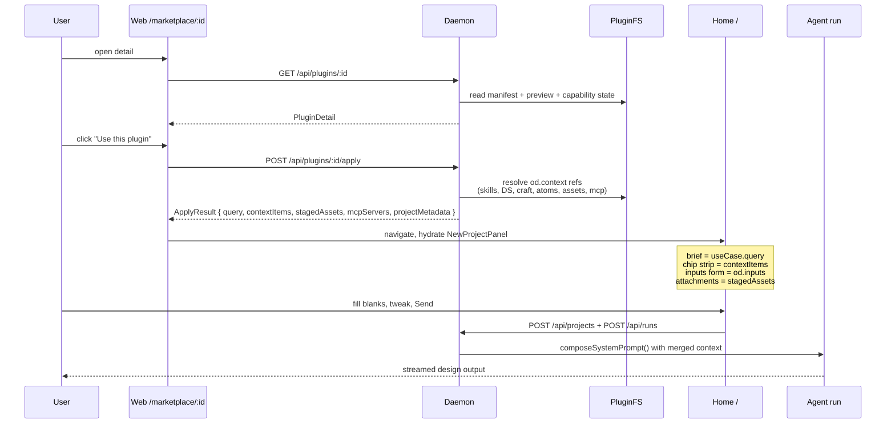
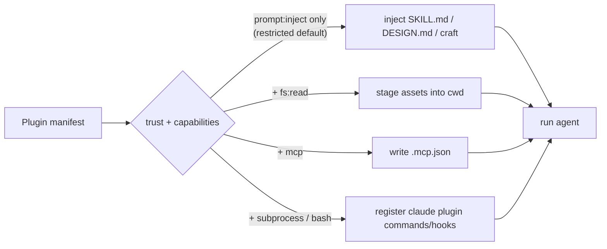

# Plugins & Marketplace Spec (v1)

**Parent:** [`spec.md`](spec.md) · **Siblings:** [`skills-protocol.md`](skills-protocol.md) · [`architecture.md`](architecture.md) · [`agent-adapters.md`](agent-adapters.md) · [`modes.md`](modes.md)

A **Plugin** is the unit of distribution for Open Design. Where a [Skill](skills-protocol.md) describes a single capability that an agent can run, a Plugin is the shippable bundle around it: one or more skills, an optional design system reference, optional craft rules, optional Claude-plugin assets, a preview, a use-case query, an asset folder, and a small machine-readable sidecar that powers OD's marketplace surface. A plugin is always anchored to a portable `SKILL.md` so it is publishable to every existing skill catalog without modification.

> **Compatibility promise (extends [`skills-protocol.md`](skills-protocol.md)):** Any plugin folder that ships a `SKILL.md` works as a plain agent skill in Claude Code, Cursor, Codex, Gemini CLI, OpenClaw, Hermes, etc. Adding `open-design.json` is purely additive — it unlocks OD's marketplace card, preview, one-click "use" flow, and typed context-chip strip, but it never changes how the underlying skill runs. **One repo, two consumption modes.**

---

## Table of contents

0. [Status](#0-status)
1. [Vision](#1-vision)
2. [Goals and non-goals](#2-goals-and-non-goals)
3. [Compatibility matrix](#3-compatibility-matrix--what-makes-a-folder-a-valid-plugin-for-whom)
4. [Plugin folder shape](#4-plugin-folder-shape)
5. [`open-design.json` schema](#5-open-designjson--schema-v1)
6. [`open-design-marketplace.json` schema](#6-open-design-marketplacejson--federated-catalog)
7. [Discovery and install](#7-discovery-and-install)
8. [The Apply pipeline](#8-the-apply-pipeline)
9. [Trust and capabilities](#9-trust-and-capabilities)
10. [First-party atoms](#10-first-party-atoms--open-designs-atomic-capabilities)
11. [Architecture — what changes in the existing repo](#11-architecture--what-changes-in-the-existing-repo)
12. [CLI surface](#12-cli-surface)
13. [Public web surface](#13-public-web-surface-open-designaimarketplace)
14. [Publishing and catalog distribution](#14-publishing-and-catalog-distribution)
15. [Deployment and portability — Docker, any cloud](#15-deployment-and-portability--docker-any-cloud)
16. [Phased implementation plan](#16-phased-implementation-plan)
17. [Examples](#17-examples)
18. [Risks and open questions](#18-risks-and-open-questions)
19. [Why this is a meaningful step for Open Design](#19-why-this-is-a-meaningful-step-for-open-design)

---

## 0. Status

- Authoring stage: draft, awaiting review.
- Defaults locked from the planning round (overridable in review):
  - **Compatibility = wrap-then-extend.** Existing `SKILL.md` and `.claude-plugin/plugin.json` repos run as-is; `open-design.json` is an additive sidecar.
  - **Trust = tiered.** Bundled and official-marketplace plugins are `trusted` by default; everything else starts `restricted` and earns capabilities through user consent.

## 1. Vision

Open Design becomes a **server + CLI + atomic core engine + plugin/marketplace system**. The product surface inverts: instead of "click a button, fill a form", users open a marketplace, click a plugin, and the input box hydrates with a query plus a typed strip of context chips above it. The same plugin folder is also a valid agent skill for Claude Code, Cursor, Codex, Gemini CLI, OpenClaw, Hermes, and is publishable as a standalone GitHub repo to:

- [`anthropics/skills`](https://github.com/anthropics/skills)
- [`anthropics/claude-code/plugins`](https://github.com/anthropics/claude-code/tree/main/plugins)
- [`VoltAgent/awesome-agent-skills`](https://github.com/VoltAgent/awesome-agent-skills)
- [`openclaw/clawhub`](https://github.com/openclaw/clawhub)
- [`skills.sh`](https://skills.sh/)

Each catalog needs a different listing format, but all of them index `SKILL.md`-shaped folders. By keeping `SKILL.md` canonical and `open-design.json` strictly sidecar, a single repo lands in every catalog without per-target rewrites.

A second axis of the same vision: **the CLI is the canonical agent-facing API for Open Design.** Code agents (Claude Code, Cursor, Codex, OpenClaw, Hermes, in-house orchestrators) drive OD by shelling out `od …`, not by hitting `/api/*` directly. The CLI wraps every server capability — project creation, conversation/run lifecycle, plugin apply, file system operations on a project, design library introspection, daemon control — behind a stable subcommand contract. The HTTP server is an implementation detail that backs the desktop UI and the CLI itself; agents that talk HTTP are bypassing the contract.

A third axis, derived from the second: **OD runs fully headless; the UI is a productivity layer, not a runtime dependency.** A user with nothing but Claude Code (or Cursor, Codex, Gemini CLI) and `od` installed can browse the marketplace, install a plugin, create a project, run a task, and consume the produced artifacts end-to-end without ever launching the desktop app. The desktop UI is exactly the same value-add Cursor's IDE adds on top of `cursor-agent` CLI: faster discovery, live artifact preview, chat/canvas side-by-side, marketplace browsing, direction-picker GUI, critique-theater panel — all sugar on the same primitives. Every UI feature is implementable as a CLI subcommand or a streaming event first; the UI consumes those primitives and adds presentation. The decoupling is enforced architecturally (§11.7).

A fourth axis, the foundation for ecosystem reach and commercial viability: **OD is one Docker image, deployable to any cloud.** Because the headless mode of (3) has no electron and no GUI dependencies, a single multi-arch container image (`linux/amd64` + `linux/arm64`) brings up the full daemon + CLI + web UI on AWS, Google Cloud, Azure, Alibaba, Tencent, Huawei, or any self-hosted Kubernetes / docker-compose / k3s setup, with no per-cloud rewrite. Self-hosted enterprises can run a private marketplace; partners can embed OD inside their stack; CI pipelines can spin up ephemeral OD containers for "generate slides for the daily report"-shaped tasks. The technical contract is in §15.

## 2. Goals and non-goals

**Goals**

1. Every OD plugin is a valid agent skill (`SKILL.md`-anchored). No fork of the skill spec.
2. A vanilla skill or claude-plugin repo becomes an OD plugin by adding an optional `open-design.json` sidecar — no rename, no body changes.
3. Three install sources: local folder, GitHub repo (with optional ref/subpath), arbitrary HTTPS archive, plus federated `open-design-marketplace.json` indexes.
4. One-click "use" auto-fills the brief input and a strip of `ContextItem` chips above it (skills, design-system, craft, assets, MCP, claude-plugin, atom).
5. Tiered trust by default; capability scoping is declarative and optional.
6. The OD core engine, atomic capabilities, and plugin runtime are all reachable from CLI so any code agent can drive Open Design headlessly.

**Non-goals (v1)**

- Replacing SKILL.md / claude-plugin spec — OD never forks.
- Hosting plugin binaries — OD points to GitHub / CDN URLs; storage is the publisher's responsibility.
- A signing/PKI ecosystem — capability gating relies on user consent, not signatures.
- A web-hosted SaaS marketplace running OD agents on behalf of users — local-first only in v1.

## 3. Compatibility matrix — what makes a folder a valid plugin for whom

| File present                                                       | OD installs    | Claude Code / Cursor / Codex / Gemini CLI | OpenClaw / Hermes | awesome-agent-skills | clawhub | skills.sh |
| ------------------------------------------------------------------ | -------------- | ----------------------------------------- | ----------------- | -------------------- | ------- | --------- |
| `SKILL.md` only                                                    | yes            | yes                                       | yes               | yes                  | yes     | yes       |
| `.claude-plugin/plugin.json` only                                  | yes            | yes (claude)                              | partial           | listable             | listable| listable  |
| `open-design.json` only                                            | yes            | no                                        | no                | no                   | no      | no        |
| `SKILL.md` + `open-design.json`                                    | enriched       | yes                                       | yes               | yes                  | yes     | yes       |
| `.claude-plugin/...` + `open-design.json`                          | enriched       | yes (claude)                              | partial           | listable             | listable| listable  |
| `SKILL.md` + `.claude-plugin/...` + `open-design.json`             | fully enriched | yes                                       | yes               | yes                  | yes     | yes       |

The takeaway: **`SKILL.md` is the lowest common denominator**. Every plugin recommended for distribution should ship a `SKILL.md` so it lands cleanly in every major catalog, then add `open-design.json` to gain OD's product surface.

## 4. Plugin folder shape

```
my-plugin/
├── SKILL.md                          # required for portability; anchors agent behavior
├── .claude-plugin/                   # optional: claude-plugin compat (commands/agents/hooks/.mcp.json)
│   └── plugin.json
├── open-design.json                  # optional sidecar — unlocks OD product surface
├── README.md                         # standard catalog readme
├── preview/                          # OD preview assets
│   ├── index.html
│   ├── poster.png
│   └── demo.mp4
├── examples/                         # sample outputs (rendered on detail page)
│   └── b2b-saas/index.html
├── assets/                           # files staged into project cwd at run time
├── skills/                           # nested skills (bundle plugins)
├── design-systems/                   # nested DESIGN.md(s)
├── craft/                            # nested craft .md(s)
└── plugins/                          # nested claude-plugins (bundle plugins)
```

Rules of authorship:

- `SKILL.md` body never carries OD-specific metadata; it stays clean and portable.
- `open-design.json` only ever **points** at SKILL.md / DESIGN.md / craft files; it never duplicates their bodies.
- Existing OD-specific frontmatter on SKILL.md (the `od:` namespace already documented in [`skills-protocol.md`](skills-protocol.md) and used in [`skills/blog-post/SKILL.md`](../skills/blog-post/SKILL.md)) is honored as a fallback for plugins without `open-design.json`. We do not deprecate it; we layer over it.

## 5. `open-design.json` — schema v1

```json
{
  "$schema": "https://open-design.ai/schemas/plugin.v1.json",
  "name": "make-a-deck",
  "title": "Make a deck",
  "version": "1.0.0",
  "description": "Generate a 12-slide investor deck from a one-line brief.",
  "author":   { "name": "Open Design", "url": "https://open-design.ai" },
  "license":  "MIT",
  "homepage": "https://github.com/open-design/plugins/make-a-deck",
  "icon":     "./icon.svg",
  "tags":     ["deck", "marketing", "investor"],

  "compat": {
    "agentSkills":   [{ "path": "./SKILL.md" }],
    "claudePlugins": [{ "path": "./.claude-plugin/plugin.json" }]
  },

  "od": {
    "kind": "skill",
    "mode": "deck",
    "platform": "desktop",
    "scenario": "marketing",
    "engineRequirements": { "od": ">=0.4.0" },

    "preview": {
      "type": "html",
      "entry":  "./preview/index.html",
      "poster": "./preview/poster.png",
      "video":  "./preview/demo.mp4",
      "gif":    "./preview/demo.gif"
    },

    "useCase": {
      "query": "Make a 12-slide investor deck for a Series A SaaS startup targeting {{audience}} on {{topic}}.",
      "exampleOutputs": [
        { "path": "./examples/b2b-saas/", "title": "B2B SaaS deck" }
      ]
    },

    "context": {
      "skills":         [{ "ref": "./skills/deck-skeleton" }],
      "designSystem":   { "ref": "linear-clone" },
      "craft":          ["typography", "deck-pacing"],
      "assets":         ["./assets/sample-data.csv"],
      "claudePlugins":  [{ "ref": "./plugins/code-review" }],
      "mcp": [
        { "name": "tavily", "command": "npx", "args": ["-y", "@tavily/mcp"] }
      ],
      "atoms": ["discovery-question-form", "todo-write", "research-search"]
    },

    "inputs": [
      { "name": "topic",    "label": "Topic",    "type": "string", "required": true },
      { "name": "audience", "label": "Audience", "type": "select",
        "options": ["VC", "Customer", "Internal"] }
    ],

    "capabilities": ["prompt:inject", "fs:read"]
  }
}
```

### 5.1 Field reference

- `compat.*` — relative paths to inherited files. The loader concatenates their content into the OD prompt stack assembled by [`composeSystemPrompt()`](../apps/daemon/src/prompts/system.ts).
- `od.preview` — drives the marketplace card and detail page. `entry` is served sandboxed via the daemon (the existing `/api/skills/:id/example` plumbing extended to plugins).
- `od.useCase.query` — the exact text that lands in the brief field on click-to-use. `{{var}}` placeholders bind to `od.inputs`.
- `od.context.*` — typed chips that hydrate the `ContextChipStrip` above the input. Each entry compiles to a `ContextItem` (§5.2).
- `od.inputs` — surfaced as form fields on the detail page; their values template `useCase.query` and any string-valued context entries.
- `od.capabilities` — declarative; defaults to `['prompt:inject']` if omitted on a `restricted` plugin.
- `od.atoms` — opt-in to OD's first-party atomic capabilities (§10).

### 5.2 `ContextItem` union (TypeScript)

```ts
export type ContextItem =
  | { kind: 'skill';         id: string; label: string }
  | { kind: 'design-system'; id: string; label: string; primary?: boolean }
  | { kind: 'craft';         id: string; label: string }
  | { kind: 'asset';         path: string; label: string; mime?: string }
  | { kind: 'mcp';           name: string; label: string; command?: string }
  | { kind: 'claude-plugin'; id: string; label: string }
  | { kind: 'atom';          id: string; label: string }
  | { kind: 'plugin';        id: string; label: string };
```

Lives in a new `packages/contracts/src/plugins/context.ts` (TypeScript-only, no runtime deps — matches the contracts boundary in the root [`AGENTS.md`](../AGENTS.md)).

### 5.3 Capability vocabulary

| Capability             | Effect granted                                                                |
| ---------------------- | ----------------------------------------------------------------------------- |
| `prompt:inject`        | SKILL/DESIGN/craft content injected into system prompt (always allowed)       |
| `fs:read`              | Stage assets into project cwd                                                 |
| `fs:write`             | Plugin-owned post-run write (e.g. publish artifacts)                          |
| `mcp`                  | Daemon writes `.mcp.json` so MCP servers from the plugin start                |
| `subprocess` / `bash`  | Claude-plugin hooks execute, agent-callable bash tools enabled                |
| `network`              | Plugin scripts may make outbound HTTP                                         |

## 6. `open-design-marketplace.json` — federated catalog

Mirrors [`anthropics/skills/.claude-plugin/marketplace.json`](https://raw.githubusercontent.com/anthropics/skills/main/.claude-plugin/marketplace.json) so existing community catalogs need only a rename to be reusable.

```json
{
  "name": "open-design-official",
  "owner":    { "name": "Open Design", "url": "https://open-design.ai" },
  "metadata": { "description": "First-party plugins", "version": "1.0.0" },
  "plugins": [
    { "name": "make-a-deck", "source": "github:open-design/plugins/make-a-deck", "tags": ["deck"] },
    { "name": "tweet-card",  "source": "https://files.../tweet-card-1.0.0.tgz",  "tags": ["marketing"] }
  ]
}
```

Multiple marketplaces coexist — the user runs `od marketplace add <url>` to register additional indexes (Vercel's, OpenClaw's clawhub, an enterprise team's private catalog).

## 7. Discovery and install

### 7.1 Discovery tiers (extends today's single-tier in [`apps/daemon/src/skills.ts`](../apps/daemon/src/skills.ts))

| Tier          | Path                                              | Source                                    |
| ------------- | ------------------------------------------------- | ----------------------------------------- |
| Bundled       | repo root `skills/`, `design-systems/`, `craft/`  | Existing — unchanged                      |
| User-global   | `~/.open-design/plugins/<id>/`                    | New — `od plugin install` writes here     |
| Project-local | `<projectCwd>/.open-design/plugins/<id>/`         | New — committed alongside user code       |

Conflict resolution: project-local wins over user-global wins over bundled, by `name`.

### 7.2 Install sources

```
od plugin install ./folder
od plugin install github:owner/repo
od plugin install github:owner/repo@v1.2.0
od plugin install github:owner/repo/path/to/subfolder
od plugin install https://example.com/plugin.tar.gz
od plugin install make-a-deck                   # via configured marketplaces
od plugin marketplace add https://.../open-design-marketplace.json
```

GitHub install path uses `https://codeload.github.com/owner/repo/tar.gz/<ref>`, no git binary required, with path-traversal guards and a configurable size cap.

## 8. The Apply pipeline

The plugin system exposes two apply surfaces; both call the same daemon endpoint and receive the same `ApplyResult`:

- **Detail-page apply** (deep): user navigates to `/marketplace/:id`, reviews the preview and capability checklist, clicks "Use this plugin". The composer is hydrated and the user lands back on Home or in the project.
- **Inline apply** (shallow, the primary product surface): the input box on Home and the input box inside an existing project (ChatComposer) both render an **inline plugins rail** directly below them. Clicking a plugin card in the rail applies the plugin **in place** — no navigation, no context loss. The brief input prefills, the chip strip above the input populates, and the plugin's `od.inputs` form blanks render between the input and the Send button. The user fills a few blanks, tweaks the brief, hits Send. This is the natural-language, fill-in-the-blank interaction that drives both project creation and per-project tasks.

The two surfaces share the same primitives (`InlinePluginsRail`, `ContextChipStrip`, `PluginInputsForm`) and the same `applyPlugin()` state helper. The only difference is the terminal endpoint: Home calls `POST /api/projects` to create a new project; ChatComposer calls `POST /api/runs` to create a new task in the active project.

### 8.1 Sequence diagrams

**Mode A — Detail-page apply (deep, after browsing the marketplace):**



**Mode B — Inline apply (shallow, primary; runs on Home and inside ChatComposer):**

```mermaid
sequenceDiagram
  participant U as User
  participant Rail as InlinePluginsRail<br/>(below input)
  participant C as Composer<br/>(NewProjectPanel or ChatComposer)
  participant D as Daemon
  participant A as Agent run

  Note over C,Rail: User is staring at an input box;<br/>plugin cards listed below it
  U->>Rail: click plugin card (no navigation)
  Rail->>D: POST /api/plugins/:id/apply<br/>{ projectId? }
  D-->>Rail: ApplyResult
  Rail->>C: hydrate in place
  Note over C: brief = useCase.query<br/>chip strip = contextItems<br/>inputs form = od.inputs (visible blanks)<br/>attachments = stagedAssets
  U->>C: fill required blanks, edit brief, Send
  alt Home (no project yet)
    C->>D: POST /api/projects + POST /api/runs
  else Existing project
    C->>D: POST /api/runs { projectId, pluginId }
  end
  D->>A: composeSystemPrompt() with merged context
  A-->>U: streamed design output
```

### 8.2 `ApplyResult` shape (new contract)

```ts
export interface ApplyResult {
  query: string;
  contextItems: ContextItem[];
  inputs: InputFieldSpec[];
  stagedAssets: { path: string; src: string }[];
  mcpServers: McpServerSpec[];
  projectMetadata: Partial<ProjectMetadata>;
  trust: 'trusted' | 'restricted';
  capabilitiesGranted: string[];
}

export interface InputFieldSpec {
  name: string;
  label: string;
  type: 'string' | 'text' | 'select' | 'number' | 'boolean';
  required?: boolean;
  options?: string[];
  placeholder?: string;
  default?: string | number | boolean;
}
```

Lives in `packages/contracts/src/plugins/apply.ts`. Re-exported from [`packages/contracts/src/index.ts`](../packages/contracts/src/index.ts).

### 8.3 Inline `od.inputs` form

When the applied plugin declares `od.inputs`, the composer renders a `PluginInputsForm` between the brief textarea and the Send button. Behavior:

- Required fields gate Send (the button is disabled with a tooltip listing missing fields).
- As the user types, `{{var}}` placeholders inside `useCase.query` and inside any string-valued `context` entry re-render live, so the user sees the final brief and final chip labels before sending.
- The form is compact by default — short fields render inline like a search bar; long-text fields collapse to a "Add details" expander.
- On Send, input values are sent alongside the run request; the daemon also passes them into the prompt under a small `## Plugin inputs` block so the agent has the literal user-supplied values, not just the post-template brief.
- Inputs persist in component state until the user clears the chip strip — re-applying the same plugin on the same composer pre-fills last-used values.

### 8.4 Apply inside an existing project (new chat task)

ChatComposer (per-project conversation input, [`apps/web/src/components/ChatComposer.tsx`](../apps/web/src/components/ChatComposer.tsx)) renders the same `InlinePluginsRail` under its input. The rail surfaces "what next?" plugins, filtered by the active project's `kind` / `scenario` / current artifacts. Clicking a card calls `POST /api/plugins/:id/apply` with the current `projectId`; the daemon resolves context against the project (skipping any context items already pinned at project creation, e.g. the design system) and returns an `ApplyResult` whose `query` and chips hydrate the composer in place. Send creates a new run via `POST /api/runs` (existing endpoint), now accepting an optional `pluginId` so the agent runtime composes prompt with the plugin context.

Net effect: a single project can be steered through many plugin-driven tasks — *"first apply make-a-deck, refine; then apply tweet-card to repackage the same brief into social posts; then apply critique-theater to grade everything"* — all without leaving the project. Each task is one chat turn; the project history is the audit log.

## 9. Trust and capabilities



A `restricted` plugin can never reach P3/P4 unless the user grants the capability — either through `od plugin trust <id>` or "Grant capabilities" on the detail page. Bundled plugins and plugins resolved through an `open-design-marketplace.json` listed in `plugin_marketplaces` (§11.4) start `trusted`; everything else starts `restricted`.

## 10. First-party atoms — Open Design's atomic capabilities

Promote what already exists in [`apps/daemon/src/prompts/system.ts`](../apps/daemon/src/prompts/system.ts) and the daemon-backed bash tools into named, declared atoms. v1 is **declarative** — atoms are identifiers a plugin opts into via `od.context.atoms`. The daemon already knows how to emit each one's prompt fragment, so no code is moved in v1.

| Atom id                          | Source today                                                       | What it does                                  |
| -------------------------------- | ------------------------------------------------------------------ | --------------------------------------------- |
| `discovery-question-form`        | `DISCOVERY_AND_PHILOSOPHY` in `system.ts`                          | Turn-1 question form for ambiguous briefs     |
| `direction-picker`               | same                                                               | 3–5 direction picker before final             |
| `todo-write`                     | same                                                               | TodoWrite-driven plan                         |
| `file-read` / `file-write` / `file-edit` | code-agent native                                          | File ops                                      |
| `research-search`                | `od research search` ([`apps/daemon/src/cli.ts`](../apps/daemon/src/cli.ts)) | Tavily web research                |
| `media-image` / `media-video` / `media-audio` | `od media generate`                                  | Media generation with provider config         |
| `live-artifact`                  | MCP `mcp__live-artifacts__*`                                       | Create/refresh live artifacts                 |
| `connector`                      | MCP `mcp__connectors__*`                                           | Composio connectors                           |
| `critique-theater`               | `system.ts` critique addendum                                      | 5-dim panel critique                          |

`GET /api/atoms` returns this list. A future Phase 4 can extract each atom into `skills/_official/<atom>/SKILL.md` so the system prompt becomes data-driven, but that is **not required for v1**.

## 11. Architecture — what changes in the existing repo

### 11.1 New package: `packages/plugin-runtime`

Pure TypeScript, no Next/Express/SQLite/browser deps:

- `parsers/manifest.ts` — read `open-design.json` → `PluginManifest` (Zod-validated).
- `adapters/agent-skill.ts` — read `SKILL.md` → synthesize a `PluginManifest` from the `od:` frontmatter documented in [`skills-protocol.md`](skills-protocol.md).
- `adapters/claude-plugin.ts` — read `.claude-plugin/plugin.json` → synthesize a `PluginManifest`.
- `merge.ts` — merge sidecar + adapters with `open-design.json` winning; foreign content lands in `compat.*`.
- `resolve.ts` — resolve `od.context.*` refs against the registry → `ResolvedContext`.
- `validate.ts` — JSON Schema (drives both runtime checks and `od plugin doctor`).

### 11.2 New contracts: `packages/contracts/src/plugins/`

`manifest.ts`, `context.ts`, `apply.ts`, `marketplace.ts`, `installed.ts`. Re-exported from [`packages/contracts/src/index.ts`](../packages/contracts/src/index.ts). Pure TypeScript only; honors the boundary rule in the root [`AGENTS.md`](../AGENTS.md).

### 11.3 Daemon changes

| File                                                                                                                                                                                                  | Change                                                                                                                            |
| ----------------------------------------------------------------------------------------------------------------------------------------------------------------------------------------------------- | --------------------------------------------------------------------------------------------------------------------------------- |
| [`apps/daemon/src/skills.ts`](../apps/daemon/src/skills.ts), [`design-systems.ts`](../apps/daemon/src/design-systems.ts), [`craft.ts`](../apps/daemon/src/craft.ts)                                  | Refactor each loader to delegate to a unified `apps/daemon/src/plugins/registry.ts`. Existing endpoints continue to work for backward compat. |
| New `apps/daemon/src/plugins/registry.ts`                                                                                                                                                             | Three-tier scan, conflict resolution, hot-reload watcher.                                                                          |
| New `apps/daemon/src/plugins/installer.ts`                                                                                                                                                            | github / https / local / marketplace install paths; tar/zip extraction; SQLite write.                                             |
| New `apps/daemon/src/plugins/apply.ts`                                                                                                                                                                | Implements `ApplyResult` assembly: resolves refs, stages assets, writes `.mcp.json` if granted.                                   |
| [`apps/daemon/src/prompts/system.ts`](../apps/daemon/src/prompts/system.ts) `composeSystemPrompt()`                                                                                                   | Accepts optional `pluginContext: ResolvedContext`; appends a `## Active plugin` block above the project metadata block. Existing layer order untouched. |
| New SQLite migration                                                                                                                                                                                  | `installed_plugins`, `plugin_marketplaces` (§11.4).                                                                               |
| [`apps/daemon/src/server.ts`](../apps/daemon/src/server.ts)                                                                                                                                           | Mount new endpoints (§11.5); `POST /api/projects` and `POST /api/runs` accept optional `pluginId`.                                |
| [`apps/daemon/src/cli.ts`](../apps/daemon/src/cli.ts)                                                                                                                                                 | New `plugin` and `marketplace` subcommand routers.                                                                                |

### 11.4 SQLite migrations (new tables only)

```sql
CREATE TABLE installed_plugins (
  id                   TEXT PRIMARY KEY,
  title                TEXT NOT NULL,
  version              TEXT NOT NULL,
  source_kind          TEXT NOT NULL,    -- bundled | user | project | marketplace | github | url | local
  source               TEXT NOT NULL,
  pinned_ref           TEXT,
  trust                TEXT NOT NULL,    -- trusted | restricted
  capabilities_granted TEXT NOT NULL,    -- JSON array
  manifest_json        TEXT NOT NULL,    -- cached open-design.json (or synthesized)
  fs_path              TEXT NOT NULL,
  installed_at         INTEGER NOT NULL,
  updated_at           INTEGER NOT NULL
);

CREATE TABLE plugin_marketplaces (
  id            TEXT PRIMARY KEY,
  url           TEXT NOT NULL,
  manifest_json TEXT NOT NULL,
  added_at      INTEGER NOT NULL,
  refreshed_at  INTEGER NOT NULL
);
```

### 11.5 New HTTP endpoints

| Method | Path                                  | Purpose                                                       |
| ------ | ------------------------------------- | ------------------------------------------------------------- |
| GET    | `/api/plugins`                        | list installed plugins (filters: kind, scenario, mode, trust) |
| GET    | `/api/plugins/:id`                    | detail (manifest, preview URLs, capability state)             |
| GET    | `/api/plugins/:id/preview`            | serve preview HTML / poster / video                           |
| GET    | `/api/plugins/:id/example/:name`      | serve example output                                          |
| POST   | `/api/plugins/install`                | body `{ source }`; streaming progress over SSE                |
| POST   | `/api/plugins/:id/uninstall`          | remove + db cleanup                                           |
| POST   | `/api/plugins/:id/trust`              | grant capabilities                                            |
| POST   | `/api/plugins/:id/apply`              | request `{ projectId? }`, returns `ApplyResult`               |
| GET    | `/api/marketplaces`                   | configured marketplaces                                       |
| POST   | `/api/marketplaces`                   | add a marketplace                                             |
| GET    | `/api/marketplaces/:id/plugins`       | catalog (paginated)                                           |
| GET    | `/api/atoms`                          | list first-party atoms                                        |

`POST /api/projects` and `POST /api/runs` (today at `server.ts:2362` / `6009`) accept an additional optional `pluginId` so the apply step can be inlined for headless flows.

> **Transport equivalence (rule of thumb).** Every endpoint above is also exposed as a CLI subcommand and, where it fits MCP semantics, as an MCP tool. Code agents should use the CLI; only the desktop web app and `od …` itself use HTTP directly. See §12 for the full CLI surface.

### 11.6 Web changes

The web surface gets two coexisting surfaces backed by the same primitives:

- **Deep / browsing surface** at `/marketplace` and `/marketplace/:id` — for discovery, install, capability review.
- **Shallow / inline surface** below the input box on Home (`NewProjectPanel`) and inside every project's chat composer (`ChatComposer`) — the primary daily-driver flow described in §8. User stares at an input, sees plugin cards under it, clicks one, fills blanks, sends.

Both surfaces share `ContextChipStrip`, `PluginInputsForm`, `InlinePluginsRail` (used as a strip on Home and a slim row in ChatComposer), and the `applyPlugin(pluginId, projectId?)` state helper.

| File                                                                                                            | Change                                                                                       |
| --------------------------------------------------------------------------------------------------------------- | -------------------------------------------------------------------------------------------- |
| [`apps/web/src/router.ts`](../apps/web/src/router.ts)                                                           | Extend `Route` union with `marketplace` and `marketplace-detail`.                            |
| New `apps/web/src/components/MarketplaceView.tsx`                                                               | Grid of plugin cards (reuses ExamplesTab card style). The deep browsing surface.             |
| New `apps/web/src/components/PluginDetailView.tsx`                                                              | Preview, use-case query, context items, sample outputs, capabilities, install/use button.    |
| New `apps/web/src/components/InlinePluginsRail.tsx`                                                             | The plugins shown directly under the input box on Home and inside ChatComposer. Filterable, ranked by recency / project relevance / `featured`. Click a card → calls `applyPlugin()` in place. Same component is used in two layouts: Home renders it as a wide grid; ChatComposer renders it as a slim horizontal strip with overflow scroll. |
| New `apps/web/src/components/ContextChipStrip.tsx`                                                              | Chip strip rendered above the brief input on both NewProjectPanel and ChatComposer. Each chip is a `ContextItem`; click opens a popover; X removes. |
| New `apps/web/src/components/PluginInputsForm.tsx`                                                              | Renders `od.inputs` as inline form fields between the brief input and Send. Required fields gate Send. As inputs change, `{{var}}` placeholders in `useCase.query` and chip labels re-render live. |
| [`apps/web/src/components/NewProjectPanel.tsx`](../apps/web/src/components/NewProjectPanel.tsx)                 | Add `contextItems` + `pluginInputs` + `appliedPluginId` state. Layout becomes: name input on top, `ContextChipStrip` above it, `PluginInputsForm` between input and Send (when a plugin is applied), and `InlinePluginsRail` below the Send button as the discovery surface. Send creates the project and the first run (existing flow), passing `pluginId` and inputs through. |
| [`apps/web/src/components/ChatComposer.tsx`](../apps/web/src/components/ChatComposer.tsx)                       | Same composer modifications as NewProjectPanel: chip strip above, inputs form between input and Send, plugins rail below. Apply calls `POST /api/plugins/:id/apply` with the current `projectId`; Send calls `POST /api/runs` with `pluginId` so the run uses the plugin's prompt context. Filters in the rail are seeded from the project's `kind` / `scenario`. |
| [`apps/web/src/components/ExamplesTab.tsx`](../apps/web/src/components/ExamplesTab.tsx)                         | Stays. Phase 3 folds it into Marketplace as a "Local skills" tab. The "Use this prompt" button there is rerouted through `applyPlugin()` so behavior matches the inline rail. |
| [`apps/web/src/state/projects.ts`](../apps/web/src/state/projects.ts)                                           | Add `applyPlugin(pluginId, projectId?)` helper hitting `POST /api/plugins/:id/apply`. Add `setPluginInputs()`, `clearAppliedPlugin()`. |

### 11.7 Headless and UI: a clean decoupling

OD runs in three operating modes that share **one** daemon, **one** CLI, and **one** plugin runtime. The differences are purely presentational. This is the same shape Cursor uses: `cursor-agent` (CLI) is sufficient on its own; the IDE is sugar.

| Mode                | What runs                                              | When to use                                          | Entry                                            |
| ------------------- | ------------------------------------------------------ | ---------------------------------------------------- | ------------------------------------------------ |
| **Headless**        | Daemon process only — no web bundle, no electron       | CI, servers, containers, Claude-Code-driven flows    | `od daemon start --headless` (new flag, Phase 2) |
| **Web**             | Daemon + local web UI (no electron)                    | Browser-only setups, Linux without GUI dependencies  | `od daemon start --serve-web` (new, Phase 2)     |
| **Desktop**         | Daemon + web bundle + electron shell                   | Full product experience (today's default)            | `od` (current default, unchanged)                |

The split is enforced by a single rule:

> **Decoupling rule.** Every UI feature is implementable as a CLI subcommand or a streaming event first. The desktop UI is allowed to render those primitives more richly; it is not allowed to introduce capabilities that have no CLI equivalent. Reviewers reject any PR that adds UI-only behavior (matches §12.6).

In practice this means:

- **Marketplace browsing** — UI: grid + filters + previews. CLI: `od plugin list/info`, `od marketplace search`, `od plugin info <id> --json` returns the same manifest the UI renders.
- **Plugin apply** — UI: click card, chips and inputs hydrate in place. CLI: `od plugin apply <id> --json` returns the identical `ApplyResult`.
- **Run streaming** — UI: chat bubbles, todo list, progress chrome. CLI: `od run start --follow` emits ND-JSON events from the same `PersistedAgentEvent` discriminated union the UI consumes.
- **Direction picker / question form** — UI: rendered as inline cards. CLI: emitted as structured events on stdout; agent or scripted wrapper picks an option by writing to stdin or via `od run respond <runId> --json '{...}'`.
- **Live artifact preview** — UI: hot-reloading iframe. CLI: `od files watch <projectId> --path <relpath>` streams change events; user opens the file with their own tool of choice.
- **Critique theater** — UI: 5-panel side-by-side. CLI: emitted as a structured `critique` event the agent or wrapper renders however it likes.

What this unlocks:

- A user with **only Claude Code** (or any code agent) plus `npm i -g @open-design/cli` plus a running headless daemon can do the entire user journey: install plugin → create project → run → consume artifacts. No OD desktop required.
- The OD desktop UI installs the same daemon and the same CLI; it just adds a window. Users who later install the desktop find the same projects, plugins, and history that the headless flow produced — there is no "headless project format" vs. "desktop project format". Same `.od/projects/<id>/`, same SQLite db.
- CI is a first-class citizen: a GitHub Action can `npm i -g @open-design/cli && od daemon start --headless && od plugin install … && od run start --project … --follow`. No display, no electron, no per-step UI scripting.
- External products can embed OD by spawning a headless daemon and shelling out — `od` is the public surface, internals are free to evolve.

The cost: a small handful of `od daemon` flags and one new lifecycle subcommand (`od daemon start/stop/status` with `--headless` / `--serve-web`). Implementation lands in Phase 2 alongside the CLI parity slice.

## 12. CLI surface

The CLI (`od …`) is **the canonical agent-facing API** for Open Design. Plugin verbs are one slice of it; the rest of the CLI wraps the daemon's core capabilities — projects, conversations, runs, file operations, design library introspection, daemon control — so that any code agent can drive OD end-to-end through shell calls. This is the "natural-language project + task creation through CLI" path: a code agent reads a user's request, then issues a sequence of `od …` calls instead of speaking HTTP.

### 12.1 Three transports of one logical API

| Transport             | Use case                                              | Implementation                                                   |
| --------------------- | ----------------------------------------------------- | ---------------------------------------------------------------- |
| HTTP (`/api/*`)       | Desktop web app, internal tooling, the CLI's own use  | [`apps/daemon/src/server.ts`](../apps/daemon/src/server.ts)      |
| **CLI (`od …`)**      | **Code agents shelling out, scripts, CI**             | [`apps/daemon/src/cli.ts`](../apps/daemon/src/cli.ts)            |
| MCP stdio             | MCP-aware agents (Claude Code, Cursor, etc.)          | `od mcp` and `od mcp live-artifacts` (existing)                  |

When a new capability ships, the CLI subcommand is the primary contract. The HTTP route exists to back the CLI; the MCP server exposes a curated subset of CLI subcommands as tools. Versioning: subcommand names, argument names, and `--json` schemas are governed by `packages/contracts` and tested in CI; breaking changes follow a major-version bump of the `od` bin.

### 12.2 Command groups

Existing commands ([`apps/daemon/src/cli.ts`](../apps/daemon/src/cli.ts)) stay; new groups added below them.

#### Project lifecycle (new)

```
od project create [--name "<title>"] [--skill <id>] [--design-system <id>]
                  [--plugin <id>] [--input k=v ...] [--brief "<text>"]
                  [--metadata-json <path|->] [--json]
od project list   [--json]
od project info   <id> [--json]
od project delete <id>
od project import <path> [--name "<title>"] [--json]   # wraps existing /api/import/folder
od project open   <id>                                 # opens browser at /projects/<id>
```

Result of `od project create --json`:

```json
{ "projectId": "p_abc", "conversationId": "c_xyz", "url": "http://127.0.0.1:17456/projects/p_abc" }
```

#### Conversation lifecycle (new)

```
od conversation list <projectId> [--json]
od conversation new  <projectId> [--name "<title>"] [--json]
od conversation info <conversationId> [--json]
```

#### Run / task lifecycle (new)

```
od run start --project <projectId> [--conversation <conversationId>]
             [--message "<text>"] [--plugin <pluginId>] [--input k=v ...]
             [--agent claude|codex|gemini] [--model <id>] [--reasoning <level>]
             [--attachments <relpath,...>] [--follow] [--json]

od run watch  <runId>                # ND-JSON SSE-equivalent events on stdout
od run cancel <runId>
od run list   [--project <id>] [--status running|done|failed] [--json]
od run logs   <runId>                # historical tail; --since for incremental
```

`--follow` on `run start` is shorthand for `start && watch`. Both stream the same event schema, defined in `packages/contracts/src/api/chat.ts` (the existing `PersistedAgentEvent` discriminated union, exposed as one event per line).

#### File system operations on a project (new)

The daemon already owns project filesystems under `.od/projects/<id>/` (or `metadata.baseDir` for imported folders). These commands are project-scoped — agents do not need to know where the project lives on disk.

```
od files list   <projectId> [--path <subdir>] [--json]
od files read   <projectId> <relpath>                   # writes to stdout
od files write  <projectId> <relpath> [< stdin]         # reads from stdin
od files upload <projectId> <localpath> [--as <relpath>]
od files delete <projectId> <relpath>
od files diff   <projectId> <relpath>                   # vs. last committed version (when imported from git)
```

A code agent typically uses `od files read` / `od files write` instead of native file ops when targeting OD-managed projects, because the daemon owns artifact bookkeeping (`ArtifactManifest.sourceSkillId`, etc. in [`packages/contracts/src/api/registry.ts`](../packages/contracts/src/api/registry.ts)).

#### Plugin verbs

```
od plugin install   <source>                            # github: | https://… | ./folder | <name from marketplace>
od plugin uninstall <id>
od plugin list      [--kind skill|scenario|atom|bundle] [--trust trusted|restricted] [--json]
od plugin info      <id> [--json]
od plugin update    [<id>]
od plugin trust     <id> [--caps fs:write,mcp,bash,hooks]
od plugin apply     <id> --project <projectId> [--input k=v ...] [--json]   # returns ApplyResult; pure (no run)
od plugin run       <id> --project <projectId> [--input k=v ...] [--follow] [--json]
                                                                            # shorthand: apply + run start --follow
od plugin export    <projectId> --as od|claude-plugin|agent-skill --out <dir>
od plugin doctor    <id>
od plugin scaffold
```

#### Marketplace verbs

```
od marketplace add     <url>
od marketplace remove  <id>
od marketplace list    [--json]
od marketplace refresh [<id>]
od marketplace search  "<query>" [--tag <tag>] [--json]   # search across configured catalogs
```

#### Design library introspection (new)

```
od skills list             [--json] [--scenario <s>] [--mode <m>]
od skills show             <id> [--json]
od design-systems list     [--json]
od design-systems show     <id> [--json]
od craft list              [--json]
od atoms list              [--json]                       # first-party atoms (§10)
```

#### Daemon control (new)

```
od daemon start  [--headless] [--serve-web] [--port <n>] [--host <h>] [--namespace <ns>]
                                                           # explicit lifecycle (§11.7);
                                                           # default `od` (no args) keeps current behavior
od daemon stop   [--namespace <ns>]
od daemon status [--json]                                   # alias of `od status`
od status        [--json]                                   # daemon up? port? namespace? installed plugins count
od doctor                                                   # diagnostics: skills/DS/craft/plugins, providers, MCP
od version       [--json]
od config get|set|list|unset  [--key ...] [--value ...]     # backed by media-config.json + db
```

`od daemon start --headless` is the entry for the headless mode in §11.7 (no web bundle, no electron). `od daemon start --serve-web` adds the local web UI without electron. Both keep using the existing tools-dev port conventions ([`OD_PORT`, `OD_WEB_PORT`](../AGENTS.md)).

#### Existing agent-callable tools (unchanged)

```
od research search ...
od media generate  ...
od tools live-artifacts ...
od tools connectors  ...
od mcp                       # stdio MCP server
od mcp live-artifacts        # specialized MCP server
```

### 12.3 Output conventions

- `--json` on every command emits structured output. Default is human-readable.
- Streaming commands (`run watch`, `run start --follow`, `plugin install`) emit ND-JSON: one JSON object per line, terminated by `\n`. Each event matches the existing `PersistedAgentEvent` schema or a small command-specific superset (e.g. install progress lines).
- Exit codes:
  - `0` — success.
  - `1` — generic failure (unstructured stderr).
  - `2` — bad usage / argument validation.
  - `64–79` — known agent-recoverable errors with structured stderr (see §12.4).
  - `>=80` — daemon errors (HTTP 5xx, etc.).

### 12.4 Recoverable error codes (for agents)

| Exit | Meaning                                | Recovery hint                                                  |
| ---- | -------------------------------------- | -------------------------------------------------------------- |
| 64   | Daemon not running                     | `od status`, then start daemon (auto-start in next versions)   |
| 65   | Plugin not found / not installed       | `od plugin list` then `od plugin install <source>`             |
| 66   | Plugin restricted, capability required | `od plugin trust <id> --caps …`                                |
| 67   | Required input missing on apply        | re-run with `--input k=v` for each missing field               |
| 68   | Project not found                      | `od project list`                                              |
| 69   | Run not found / already terminal       | `od run list --project <id>`                                   |
| 70   | Provider not configured                | `od config set ...` for the provider key                       |

When `--json` is set, structured error output is `{ "error": { "code": "<short-code>", "message": "<human>", "data": { ... } } }` on stderr. The exit codes above remain stable; the human prose may evolve.

### 12.5 Authoring patterns for code agents

A code agent driving Open Design through the CLI typically does:

```bash
# 1. (Optional) Inspect what's available.
od skills list --json
od plugin list --json

# 2. Create a project bound to a skill or design system.
PID=$(od project create --skill blog-post --design-system linear-clone --json | jq -r .projectId)

# 3. Apply a plugin to preview the brief and context (pure; no run yet).
od plugin apply make-a-deck --project "$PID" --input topic="agentic design" --input audience=VC --json

# 4. Start the run, follow events live (ND-JSON on stdout).
od run start --project "$PID" --plugin make-a-deck \
             --input topic="agentic design" --input audience=VC \
             --message "Make it concise; investor-ready." --follow \
  | jq -r 'select(.kind == "message_chunk") | .text' \
  | tee run.log

# 5. Consume produced artifacts.
od files list "$PID" --json
od files read "$PID" index.html > out.html
```

This sequence works identically locally, in CI, in a Docker sidecar, or driven from inside another agent loop. No HTTP, no port discovery, no auth tokens — the CLI hides all of that behind the stable subcommand contract.

### 12.6 What this means for the existing CLI

Every group above is additive to [`apps/daemon/src/cli.ts`](../apps/daemon/src/cli.ts). The current default `od` (start daemon + open web UI) remains unchanged. Existing `od media`, `od research`, `od tools`, `od mcp` commands keep their exact contracts. The new groups are wrappers around endpoints that already exist in `apps/daemon/src/server.ts` for the ones the desktop UI uses today (project create/list, run start/watch, file upload/list), plus the new endpoints from §11.5 for plugins/marketplace/atoms.

> **Implementation rule:** if a code agent can do something through the desktop UI, it MUST be doable through `od …` with the same arguments and equivalent output. No silent UI-only capabilities.

## 13. Public web surface (open-design.ai/marketplace)

The product site already lives at [open-design.ai](https://open-design.ai). The public marketplace ships as a path on that same site — `open-design.ai/marketplace` (canonical) with `open-design.ai/plugins` as an alias — not as a separate domain. It is a static-rendered catalog rendered from the official `open-design-marketplace.json` index, with plugin detail pages backed by the same `open-design.json` files inside each listed repo. Visually it mirrors what [`skills.sh`](https://skills.sh/) does for skills, but its detail pages render OD-specific previews (the `od.preview.entry` HTML, sample outputs, the use-case query, the chip preview).

The site shares one source of truth with the in-app marketplace:

- Same JSON Schemas (`https://open-design.ai/schemas/plugin.v1.json`, `https://open-design.ai/schemas/marketplace.v1.json`).
- Same federated listing format (`open-design-marketplace.json`).
- Same plugin manifests (`open-design.json` inside each repo).

Two consumption surfaces, one substrate:

| Surface                                                | Audience                       | Primary CTA                                                                                                       |
| ------------------------------------------------------ | ------------------------------ | ----------------------------------------------------------------------------------------------------------------- |
| In-app marketplace (`/marketplace`, §11.6)             | Logged-in OD users             | "Use this plugin" → applies in place                                                                              |
| Public marketplace (`open-design.ai/marketplace`)      | Anonymous visitors, SEO, share | Deep-link `od://plugins/<id>?apply=1` (auto-installs and applies in the desktop app), plus "Copy install command" |

Deep-link contract (Phase 4 deliverable, scoped here so the schema supports it):

- `od://plugins/<id>` — open the plugin detail in the in-app marketplace.
- `od://plugins/<id>?apply=1[&input.k=v...]` — install if missing, then apply with the supplied inputs.
- `od://marketplace/add?url=<urlencoded>` — register a new federated catalog.

The desktop app registers the `od://` URL scheme; clicking a button on `open-design.ai/marketplace` either launches the desktop or, if it is not installed, falls back to a "How to install Open Design" flow.

**Status: out of scope for the v1 implementation,** but the JSON shapes and the URL scheme are locked here so the in-app marketplace and the public site can be developed independently without divergence.

## 14. Publishing and catalog distribution

A single GitHub repo per plugin, simultaneously usable across every catalog the user mentioned:

| Catalog                                                                                          | What it needs                                                              | What we ship in the repo                              |
| ------------------------------------------------------------------------------------------------ | -------------------------------------------------------------------------- | ----------------------------------------------------- |
| [`anthropics/skills`](https://github.com/anthropics/skills)                                      | `SKILL.md` with `name`/`description` frontmatter                          | `SKILL.md` (canonical anchor)                          |
| [`anthropics/claude-code/plugins`](https://github.com/anthropics/claude-code/tree/main/plugins)  | `.claude-plugin/plugin.json` + standard structure                          | `.claude-plugin/plugin.json` (optional)                |
| [`VoltAgent/awesome-agent-skills`](https://github.com/VoltAgent/awesome-agent-skills)            | PR adds a row pointing at the repo URL                                     | repo URL — automation in §14.1                         |
| [`openclaw/clawhub`](https://github.com/openclaw/clawhub)                                        | submission via clawhub web app or PR                                       | repo URL                                                |
| [`skills.sh`](https://skills.sh/)                                                                | indexed automatically once `npx skills add owner/repo` is observed         | repo URL                                                |
| `open-design-marketplace.json`                                                                   | entry referencing `github:owner/repo`                                      | `open-design.json` enriches the listing                |

### 14.1 Author tooling

- `od plugin scaffold` — writes a starter folder containing both `SKILL.md` (industry-standard, with `od:` frontmatter for backward compat) and `open-design.json` (OD enrichment with `compat.agentSkills` pointing at the SKILL.md).
- `od plugin doctor` — runs the JSON Schema, the SKILL.md frontmatter parser, and a "does this look listable on awesome-agent-skills / clawhub / skills.sh?" lint that checks for README presence, license file, and frontmatter completeness.
- `od plugin publish --to <catalog>` (Phase 4) — opens a browser to the catalog's PR template with a pre-filled row.

### 14.2 Cross-agent consumption

Any code agent that consumes a folder via `SKILL.md` works without OD installed. The plugin is one repo with three valid consumption modes:

1. **Skill-only consumption (no OD).** A Cursor user runs `npx skills add open-design/make-a-deck`. Cursor reads `SKILL.md` and runs the workflow. No OD CLI, no OD daemon. The plugin's marketplace polish (`open-design.json`) is ignored — Cursor sees a vanilla skill.
2. **Headless OD (CLI + code agent, no OD UI).** A power user keeps using their preferred code agent — Claude Code, Cursor, Codex, etc. — but adds OD as a side service to gain plugin context resolution, project bookkeeping, design library injection, and artifact tracking. No browser, no electron. See §14.3 below for the concrete pipeline.
3. **Full OD (CLI + code agent + OD UI).** Same as (2) plus the desktop or web UI for live preview, marketplace browsing, chat/canvas split-view, etc.

The plugin author writes the SKILL.md once. All three modes consume it.

### 14.3 Concrete headless pipeline (Claude Code + `od` CLI, no OD UI)

This mirrors what cursor-agent + scripts can do for Cursor — code agent does the thinking, OD CLI provides the project / plugin / artifact substrate.

```bash
# One-time setup: install the OD CLI as an npm global (publishable as @open-design/cli).
npm install -g @open-design/cli

# Start the daemon in headless mode — no web bundle, no electron, no browser.
od daemon start --headless --port 17456

# Install the OD plugin you want to drive (or an upstream agent skill — both work).
od plugin install github:open-design/plugins/make-a-deck

# Create a project bound to the plugin. Inputs are templated into the brief.
PID=$(od project create \
        --plugin make-a-deck \
        --input topic="agentic design" \
        --input audience=VC \
        --json | jq -r .projectId)

# Drive the run with Claude Code (or any code agent). Two equivalent paths:

# Path A — let `od` orchestrate Claude Code as the run's agent:
od run start --project "$PID" --plugin make-a-deck \
             --agent claude --follow

# Path B — drive Claude Code directly inside the project cwd; OD only provides
# context resolution and artifact bookkeeping. Useful when the user's existing
# code-agent setup is opinionated.
CWD=$(od project info "$PID" --json | jq -r .cwd)
cd "$CWD"
# OD has already staged the merged SKILL.md / DESIGN.md / craft / atoms into
# .od-skills/ inside the cwd, exactly as the desktop run would.
claude code "Read .od-skills/ and produce the deliverables the active plugin describes."

# Consume the produced artifacts.
od files list "$PID" --json
od files read "$PID" slides.html > slides.html
open slides.html      # or however the user wants to view the file
```

What this proves:

- The full marketplace -> plugin -> apply -> run -> artifact pipeline is reachable from a terminal in <10 lines.
- The OD daemon does not need to render anything; it acts as a project + plugin + artifact server.
- The same project, when later opened in the OD desktop UI, shows the full conversation history, files, and artifacts produced by the headless run — because there is exactly one storage layer (§4.6 in [`spec.md`](spec.md), `.od/projects/<id>/` + SQLite).

### 14.4 Analogy: Cursor vs `cursor-agent`, OD desktop vs `od` CLI

The mental model:

| Layer                 | Cursor                                       | Open Design                                          |
| --------------------- | -------------------------------------------- | ---------------------------------------------------- |
| Headless agent CLI    | `cursor-agent` (drives the agent loop)       | `od run start --agent claude --follow` + `od plugin run` |
| Local services / db   | Cursor's background indexing / state         | OD daemon, SQLite, `.od/projects/<id>/`              |
| GUI productivity layer| Cursor IDE                                   | OD desktop / web UI (`apps/web` + `apps/desktop`)    |
| Plugin / skill format | `.cursor/rules/`, MCP servers                | `SKILL.md` + `open-design.json` + atoms              |

Both products are decoupled the same way: the terminal flow is sufficient; the IDE/desktop is the productivity multiplier. **Plugin authors never have to choose** — they write one SKILL.md plus optional sidecar, and reach all three consumption modes.

## 15. Deployment and portability — Docker, any cloud

OD ships as a single multi-arch Docker image so the full plugin/marketplace system can be brought up with one command and run unchanged on every major cloud. This is the substrate for the ecosystem and commercial story: a partner self-hosts inside their VPC; an enterprise runs a private marketplace; a CI job spins up a per-job OD daemon. The image is the headless mode of §11.7 packaged for ops, optionally serving the web UI from §11.6 when `--serve-web` is set.

### 15.1 Image shape

- **Tag**: `ghcr.io/open-design/od:<version>` plus moving `:latest` and `:edge`.
- **Architectures**: `linux/amd64` and `linux/arm64` (single manifest list).
- **Contents**:
  - Node 24 runtime + the daemon `dist/` bundle.
  - The `od` CLI on PATH.
  - Web UI bundle (apps/web build) so the same image serves both API and UI.
  - Bundled code-agent CLIs that OD supports as agent backends: Claude Code, Codex CLI, Gemini CLI. Selectable per run; default is `OD_AGENT_BACKEND`.
  - Common runtime deps plugins assume: `ffmpeg`, `git`, `ripgrep`.
- **Excluded**: electron, native macOS/Windows toolchains, dev tooling.

The base image is `node:24-bookworm-slim`. The user inside the container is non-root (`uid 10001`).

### 15.2 Persistence

Three paths the operator should mount as volumes; they map onto existing OD env vars from the root [`AGENTS.md`](../AGENTS.md), so no daemon code change is needed.

| Mount path        | Env var                  | Purpose                                                |
| ----------------- | ------------------------ | ------------------------------------------------------ |
| `/data/od`        | `OD_DATA_DIR`            | Projects, SQLite, artifacts, installed plugins (`.od/` and `~/.open-design/plugins/` collapse here) |
| `/data/config`    | `OD_MEDIA_CONFIG_DIR`    | Provider credentials (`media-config.json`)             |
| `/data/marketplaces` | (under `OD_DATA_DIR`)  | Cached marketplace indexes                             |

Mounting `/data/od` alone is the minimal config. Splitting `/data/config` separately is the recommended hosted-mode pattern so secrets follow a different lifecycle than data.

### 15.3 Configuration

All configuration flows through env vars and an optional pre-baked config file. Minimal hosted env:

```env
OD_PORT=17456
OD_HOST=0.0.0.0
OD_DATA_DIR=/data/od
OD_MEDIA_CONFIG_DIR=/data/config
OD_NAMESPACE=production              # multi-tenant isolation key
OD_TRUST_DEFAULT=restricted          # safe default for hosted (§9)
OD_AGENT_BACKEND=claude              # default code agent backend
OD_API_TOKEN=<random>                # required when OD_HOST != 127.0.0.1
ANTHROPIC_API_KEY=...                # provider keys; also storable via `od config set`
TAVILY_API_KEY=...
```

Anything settable via the desktop UI is also settable via `docker exec od od config set ...` or by mounting a pre-baked `media-config.json` into `/data/config`.

### 15.4 One-command deploy

Local laptop:

```bash
docker run --rm -p 17456:17456 ghcr.io/open-design/od:latest
open http://localhost:17456
```

Persistent server:

```bash
docker run -d --name od \
  -p 17456:17456 \
  -v od-data:/data/od \
  -v od-config:/data/config \
  -e OD_DATA_DIR=/data/od \
  -e OD_MEDIA_CONFIG_DIR=/data/config \
  -e OD_HOST=0.0.0.0 \
  -e OD_API_TOKEN="$(openssl rand -hex 32)" \
  -e ANTHROPIC_API_KEY="$ANTHROPIC_API_KEY" \
  ghcr.io/open-design/od:latest
```

Reach the same surfaces inside the container:

```bash
docker exec od od plugin install github:open-design/plugins/make-a-deck
docker exec od od project create --plugin make-a-deck --json
docker exec od od status --json
```

### 15.5 Multi-cloud portability

The image is deliberately cloud-agnostic. One container image runs on every major cloud's container service:

| Cloud              | Container service                          | Persistent storage          | Secrets                |
| ------------------ | ------------------------------------------ | --------------------------- | ---------------------- |
| AWS                | ECS / Fargate / EKS / App Runner           | EFS (NFS), EBS, S3 adapter  | Secrets Manager / SSM  |
| Google Cloud       | Cloud Run / GKE                            | Filestore, GCS-fuse         | Secret Manager         |
| Azure              | Container Apps / AKS                       | Azure Files                 | Key Vault              |
| Alibaba Cloud      | SAE / ACK                                  | NAS, OSS adapter            | KMS                    |
| Tencent Cloud      | CloudRun / TKE                             | CFS, COS adapter            | SSM                    |
| Huawei Cloud       | CCE / CCI                                  | SFS, OBS adapter            | KMS                    |
| Self-hosted        | docker-compose, Docker Swarm, k3s, k0s     | Bind mounts, NFS, Longhorn  | env / SOPS / Vault     |

Two reference manifests ship with OD and are versioned alongside the image:

- New `tools/pack/docker-compose.yml` — daemon + optional reverse proxy + optional Postgres for §15.6.
- New `tools/pack/helm/` — Helm chart with values presets for each cloud's volume + secret patterns. The chart deliberately stays generic — cloud-specific bootstrap (CloudFormation / Deployment Manager / ARM / Aliyun ROS / Tencent TIC / Huawei RFS) lives in a separate `open-design/deploy` repo so it can move at its own cadence.

### 15.6 Pluggable storage and database (Phase 5)

The daemon's filesystem and SQLite usage is encapsulated behind two narrow interfaces:

- `ProjectStorage` — read/write/list project files.
- `DaemonDb` — typed wrapper around SQLite (already exists today).

v1 ships only the local-disk + SQLite implementation. Phase 5 adds:

- **`ProjectStorage` adapter for S3-compatible blob stores.** Works for AWS S3, GCS (S3-compatible mode), Azure Blob (S3-compat shim or native), Aliyun OSS, Tencent COS, Huawei OBS — all speak the S3 API or have a thin shim.
- **`DaemonDb` adapter for Postgres** so multiple daemon replicas can share state. Useful behind a load balancer or when running serverless containers that may scale to zero.

The on-disk layout stays identical between adapters so a single-tenant deployment can migrate to multi-replica without re-importing projects.

### 15.7 Hosted-mode security defaults

Defaults shift toward safer behavior when the daemon runs in a container:

- `OD_TRUST_DEFAULT=restricted` is the recommended default. Capabilities (`mcp`, `subprocess`, `bash`, `network`) require explicit operator opt-in via `od plugin trust <id>` or a `OD_TRUSTED_PLUGINS` allow-list env var.
- The image runs as a non-root user; plugin sandboxes inherit this.
- The HTTP API listens on `OD_HOST`; when set to `0.0.0.0`, `OD_API_TOKEN` is required and is checked on every request via `Authorization: Bearer <token>`. When unset, the daemon refuses to bind to a public interface and exits with an error.
- A future hardening pass (Phase 5) optionally runs each plugin's bash/MCP work inside per-run nested containers (firecracker / gVisor / sysbox) so an untrusted plugin cannot escape the run boundary. Not required for v1 single-tenant deployments.
- **Authentication scope (v1):** single-tenant only — one shared `OD_API_TOKEN`. **Multi-tenant auth** (per-user OAuth, RBAC, project ownership, billing) is **explicitly out of scope for v1** and tracked as an open item in §18.

### 15.8 What this unlocks (ecosystem motions)

1. **Self-hosted enterprise.** A company hosts a private OD instance, registers an internal `open-design-marketplace.json` (`od marketplace add https://internal/...`), restricting plugins to internally vetted ones. Their designers and PMs use the desktop client locally; their CI uses `docker exec od od …`.
2. **Partner integrations.** Vendors (CMS, design tools, BI platforms, SaaS dashboards) embed OD inside their stack to add design generation. One image, no per-vendor port.
3. **Cloud-native CI.** "Generate slides for the daily report" becomes a GitHub Action / GitLab pipeline / Tekton task that spins up an ephemeral OD container, applies a plugin, drops artifacts to S3 / OSS / COS / OBS.
4. **Sovereign-cloud reach.** OD runs unchanged on Aliyun / Tencent / Huawei for customers in regulated regions — no rewrite, no separate distribution channel.

## 16. Phased implementation plan

### Phase 0 — Spec freeze (1–2 days)

- This document lands as `docs/plugins-spec.md` (current).
- JSON Schemas at `docs/schemas/open-design.plugin.v1.json` and `open-design.marketplace.v1.json`.
- Pure-TS contracts at `packages/contracts/src/plugins/{manifest,context,apply,marketplace,installed}.ts`.
- Migration note: existing `skills/`, `design-systems/`, `craft/` are 100% backward compatible. SKILL.md frontmatter unchanged.

Validation: `pnpm guard`, `pnpm typecheck`, `pnpm --filter @open-design/contracts test`.

### Phase 1 — Loader, installer, persistence + plugin CLI (3–5 days)

- `packages/plugin-runtime` with parsers/adapters/merger/resolver/validator.
- `apps/daemon/src/plugins/{registry,installer,apply}.ts`; refactor existing skills/DS/craft loaders to delegate.
- SQLite migration for `installed_plugins` and `plugin_marketplaces`.
- Endpoints: `GET /api/plugins`, `GET /api/plugins/:id`, `POST /api/plugins/install` (folder + github tarball), `POST /api/plugins/:id/uninstall`, `POST /api/plugins/:id/apply`, `GET /api/atoms`.
- **CLI (plugin verbs):** `od plugin install/list/info/uninstall/apply/doctor`. `od plugin apply --json` is required by Phase 2's inline rail and by external code agents.
- `~/.open-design/plugins/<id>/` write path with safe extraction (path-traversal guard, size cap, symlink rejection).

Validation: `pnpm --filter @open-design/plugin-runtime test` (parser fixtures: pure SKILL.md, pure claude plugin, pure open-design.json, all three combined). `pnpm --filter @open-design/daemon test`. `pnpm guard`, `pnpm typecheck`. CLI smoke: `od plugin install ./fixtures/sample-plugin` → `od plugin list --json` → `od plugin apply <id> --project <id> --json`.

### Phase 2 — Marketplace UI + apply pipeline (5–7 days)

- New routes `/marketplace`, `/marketplace/:id`.
- New components: `ContextChipStrip`, `InlinePluginsRail`, `PluginInputsForm`, `MarketplaceView`, `PluginDetailView` (§11.6).
- Inline rail integrated into `NewProjectPanel` and `ChatComposer` (§8.4).
- `applyPlugin()` wiring; `POST /api/plugins/:id/apply` returns `ApplyResult` with `inputs: InputFieldSpec[]`.
- `composeSystemPrompt()` accepts `ResolvedContext` and emits `## Active plugin — <title>` plus a `## Plugin inputs` block.
- Preview rendering through `/api/plugins/:id/preview` (mirrors today's `/api/skills/:id/example`).
- **CLI parity for the project + run + files lifecycle (so external code agents reach feature parity with the desktop UI):** `od project create/list/info/delete/import`, `od run start/watch/cancel/list/logs` (with `--follow` and ND-JSON streaming), `od files list/read/write/upload/delete`. These wrap endpoints already used by the desktop UI today (`POST /api/projects`, `POST /api/runs`, `GET /api/runs/:id/events`, project upload/list/read endpoints) — no new HTTP surface, only CLI surface.

Validation: e2e in `e2e/`: (a) install local plugin → marketplace → click detail → "Use" → home prefilled → run produces design. (b) End-to-end CLI walkthrough from §12.5 — `od project create` → `od plugin apply --json` → `od run start --follow` → `od files read` produces the same artifact bytes as the UI flow.

### Phase 3 — Federated marketplace + tiered trust (3–5 days)

- `od marketplace add/remove/list/refresh`; `od plugin install <name>` resolves through marketplaces.
- `GET /api/marketplaces`, `POST /api/marketplaces`, `GET /api/marketplaces/:id/plugins`.
- Trust UI on `PluginDetailView` (capability checklist + "Grant" action).
- Apply pipeline gates by `trust` + `capabilities_granted`.
- Bundle plugins (multiple skills + DS + craft in one repo) — installer fans out into the registry under namespaced ids.
- `od plugin doctor <id>` runs full validation.

Validation: install plugin from a local mock marketplace.json, rotate ref, uninstall. Restricted plugin cannot start MCP server until "Grant" is clicked.

### Phase 4 — Atoms, publish-back, full CLI parity (1–2 weeks, splittable)

- Document atoms in `docs/atoms.md`; expose via `GET /api/atoms`.
- `od plugin export <projectId> --as od|claude-plugin|agent-skill` — generates a publish-ready folder from an existing project.
- `od plugin run <id> --input k=v --follow` — shorthand wrapper for apply + run start + watch.
- `od plugin scaffold` interactive starter.
- `od plugin publish --to anthropics-skills|awesome-agent-skills|clawhub` opens a PR template.
- **Remaining CLI parity:** `od conversation list/new/info`, `od skills/design-systems/craft/atoms list/show`, `od status/doctor/version`, `od config get/set/list`, `od marketplace search`. All purely CLI work — endpoints exist or are trivial.
- Optional: extract atoms into `skills/_official/<atom>/SKILL.md`. Only after Phases 1–3 are stable.

Validation: (a) install a published plugin → export from a real project that used it → diff the produced manifest against the original. (b) "UI vs CLI parity test": pick 5 desktop-UI workflows, replay each one through `od …` only, compare produced artifacts byte-for-byte (per the §12.6 implementation rule).

### Phase 5 — Cloud deployment + pluggable storage (parallel, splittable)

This phase is independent of Phases 1–4 and can run in parallel as soon as Phase 1 lands (since the headless mode and the daemon contract are stable from Phase 1 on).

- **Container image (week 1):** multi-arch `linux/amd64` + `linux/arm64` Dockerfile with the contents listed in §15.1; CI to push `:edge` on every main commit and `:<version>` on tag.
- **Reference manifests:** `tools/pack/docker-compose.yml` and `tools/pack/helm/`. The compose file demonstrates the daemon + reverse proxy pattern; the Helm chart parameterizes volume + secret patterns for any cloud.
- **Bound-API-token guard:** daemon refuses to bind `OD_HOST=0.0.0.0` without `OD_API_TOKEN`; bearer-token middleware on `/api/*` (skipped only when host is loopback).
- **`ProjectStorage` adapter for S3-compatible blob stores** (works for AWS S3, GCS S3-compat, Azure Blob via shim, Aliyun OSS, Tencent COS, Huawei OBS).
- **`DaemonDb` adapter for Postgres** (so multi-replica deployments share state).
- **Per-cloud one-click templates** in a separate `open-design/deploy` repo (CloudFormation, Deployment Manager, ARM, Aliyun ROS, Tencent TIC, Huawei RFS) — non-blocking; track separately.

Validation:
- `docker run` smoke: image starts, web UI renders, `od plugin install` works inside the container.
- Multi-cloud smoke: deploy the compose file to AWS Fargate, GCP Cloud Run, Azure Container Apps, Aliyun SAE, Tencent CloudRun, Huawei CCE; run a fixed plugin → produced artifact bytes identical across clouds.
- Pluggable storage smoke: same plugin, same project, alternating between local-disk + SQLite and S3 + Postgres adapters; produced artifacts identical.

## 17. Examples

### 17.1 Minimum-viable plugin (just SKILL.md)

OD reads it as a plugin via the existing `od:` frontmatter loader documented in [`skills-protocol.md`](skills-protocol.md). No `open-design.json` needed — the plugin lacks marketplace polish but is fully runnable.

```
my-plugin/
└── SKILL.md
```

```yaml
---
name: my-plugin
description: One-paragraph what+when.
od:
  mode: prototype
  scenario: marketing
---
# My Plugin
Workflow steps...
```

### 17.2 Enriched plugin (cross-catalog publishable, full OD product surface)

```
my-plugin/
├── SKILL.md
├── README.md
├── open-design.json
├── preview/
│   ├── index.html
│   ├── poster.png
│   └── demo.mp4
└── examples/
    └── b2b-saas/index.html
```

`SKILL.md` stays portable — Cursor / Codex / OpenClaw read it directly. `open-design.json` adds preview, query, chip strip, capabilities. The repo lists cleanly on every catalog in §14 without modification.

### 17.3 Bundle plugin (multiple skills + DS + craft in one repo)

```
my-bundle/
├── SKILL.md                          # bundle-level overview (catalog uses this)
├── open-design.json                  # kind: 'bundle'; lists nested skills
├── skills/
│   ├── deck-skeleton/SKILL.md
│   └── deck-finalize/SKILL.md
├── design-systems/linear-clone/DESIGN.md
└── craft/deck-pacing.md
```

The installer fans out nested skills/design-systems/craft into the registry under namespaced ids (`my-bundle/deck-skeleton`, etc.), so any of them can be referenced individually by other plugins.

## 18. Risks and open questions

| Risk                                                        | Mitigation                                                                                          |
| ----------------------------------------------------------- | --------------------------------------------------------------------------------------------------- |
| Schema drift between OD plugin and the broader skill spec   | `open-design.json` is sidecar-only; it never modifies SKILL.md. CI tests run against the public anthropics/skills repo. |
| Arbitrary GitHub install = supply-chain risk                | `restricted` default; capability prompt mandatory before bash/hooks/MCP; pinned-ref recording.       |
| `composeSystemPrompt()` is already 200+ lines               | The `## Active plugin` block is appended in the existing place; no reordering of layers.             |
| ExamplesTab vs Marketplace overlap                          | Phase 2 keeps ExamplesTab as is; Phase 3 folds it into Marketplace as a "Local skills" tab.         |
| Atoms-as-plugins is large                                   | Phase 4 only; v1 atoms are declarative refs, not extracted code.                                    |
| Project-local plugins committed to user repos               | Discovery only at `<projectCwd>/.open-design/plugins/`; opt-in via `od plugin install --project`.    |
| Trust model leaves community plugins half-functional by default | Detail page surfaces a clear capability checklist with a one-click "Grant all" action; restricted-mode behavior is explicit, not silent. |
| Plugins shipping their own MCP servers may fail to start    | `od plugin doctor` runs a dry-launch of declared MCP commands; failures surfaced before "Use".       |
| Hosted deployments without the bound-API-token guard could leak the API publicly | Daemon refuses to bind `OD_HOST=0.0.0.0` without `OD_API_TOKEN`; bearer-token middleware enforced on `/api/*`; documented in §15.7. |
| Sovereign-cloud customers (Aliyun / Tencent / Huawei) need provider-specific secret + storage integrations | S3-compatible adapter covers all three for blob storage (Phase 5); env-var-based secrets work everywhere; cloud-specific KMS integrations are non-blocking (post-v1). |
| Multi-cloud testing matrix is large                         | Phase 5 ships a single canonical compose smoke (one cloud), then adds clouds incrementally; per-cloud one-click templates live in `open-design/deploy` and can move at their own cadence (§15.5). |

Open questions worth confirming before code lands:

- **Default trust tier** — keep tiered (current) or shift to capability-scoped from day 1?
- **Marketplace JSON shape** — diverge from anthropic's `marketplace.json` shape, or stay byte-compatible so existing claude-plugin marketplaces are reusable as-is? (Default: stay byte-compatible.)
- **`od plugin run` headless contract** — sufficient as-is, or also expose an HTTP POST endpoint for non-CLI agents? (Default: CLI only in v1; HTTP added in Phase 4 if needed.)
- **Multi-tenant auth (per-user OAuth, RBAC, project ownership, billing)** is explicitly out of scope for v1. The Docker image is single-tenant by design (one `OD_API_TOKEN`). Multi-tenancy is a post-v1 story that needs its own spec — confirm this scoping is acceptable for the first ecosystem release.
- **Trust defaults in hosted mode** — current spec recommends `OD_TRUST_DEFAULT=restricted` for containers; should we go further and **forbid** `trusted` for plugins from arbitrary GitHub URLs unless a marketplace they belong to is also explicitly trusted via `od marketplace add --trust`? (Default: just recommend, don't forbid.)
- **Discovery-time hot reload** — should the daemon watch `~/.open-design/plugins/` for filesystem changes (developer ergonomics), or only reload after `od plugin install/update/uninstall` (stability)? (Default: watch, with a 500ms debounce.)
- **Versioning policy** — pin to a tag/SHA on install, or always track the default branch with an opt-in pin? (Default: pin to the resolved ref at install time; `od plugin update` re-resolves.)

## 19. Why this is a meaningful step for Open Design

- **Inherited supply.** Every public agent skill on `anthropics/skills`, `awesome-agent-skills`, `clawhub`, and `skills.sh` is one optional `open-design.json` away from being an OD plugin — and reciprocally, every OD plugin is publishable to all four catalogs without modification.
- **Boundary-clean.** New code lives in two pure-TS packages (`packages/plugin-runtime`, `packages/contracts/src/plugins/*`) and one daemon module group (`apps/daemon/src/plugins/`); no cross-app coupling, no contracts package leaks, no SKILL.md fork. Honors every constraint in the root [`AGENTS.md`](../AGENTS.md).
- **Reversible refactors.** Existing loaders ([`apps/daemon/src/skills.ts`](../apps/daemon/src/skills.ts) etc.) and `composeSystemPrompt()` keep their public shape; Phase 1 is a drop-in delegate, Phase 2 only **appends** a prompt block.
- **CLI from day 1.** Every new endpoint has a matching `od plugin …` subcommand, so the same surface is reachable from any code agent without the desktop app.
- **Marketplace-first product narrative.** From Phase 2 onward, the home screen becomes "input + chip strip + deep marketplace" — exactly the inversion described in the brief: 主交互 = 输入框 + 插件社区.

---

*End of spec. Review and refine inline. Confirm the plan and Phase 0 before any non-markdown changes land.*


